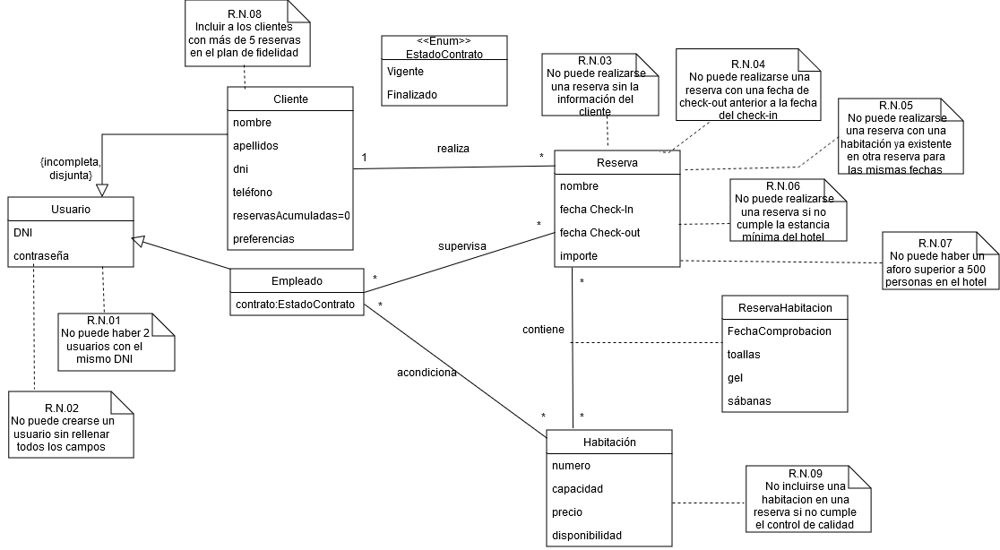
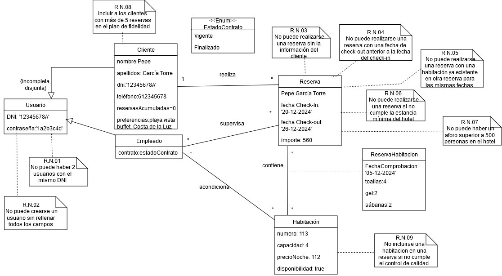
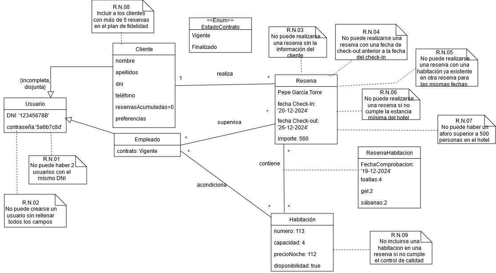

# Hotel Poligoni I
## Miembros del grupo L5-TI3-8 (sustituir)

1. Rico Hernández, Adrián
1. Moraleda Álvarez, Pablo
1. Novalio Rodriguez, Lucia
1. Muñoz Fuentes, Sebastián

## 1. Introducción al problema
La gestión del sector hotelero requirere una combinación de habilidades estratégicas, operativas y de marketing plasmadas en un estricto plan comercial y la estrategia satisfacción de clientes. Toda la toma de decisiones sobre estos aspectos debe fundamentarse en datos, de ahí la necesidad de un sistema informático que recopile toda esta información de la manera más eficiente y precisa.

El gestor del hotel se encuentra con la problemática de un sistema informático obsoleto, procesando las reservas mediante llamadas telefónicas y registrando la información de las reservas manualmente en tablas dinámicas de excel, así como el control de calidad y de stock. Tras realizar una entrevista inicial con el cliente, se decidió desarrollar un sistema que automatice el proceso de reservas optimizando así los recursos humanos y mejorando la experiencia del cliente al hacer más comodidad de la gestión.Además, este sistema facilita en gran medida el análisis de previsiones para optimizar el plan comercial y la estrategia de marketing. Para desarrollar dicho sistema, requeriremos cierta información al cliente a través de nuestra página web que posteriormente, nuestros trabajadores procesaran y analizarán.

## 2. Glosario de términos

- **Check-in:**
Proceso en el que el cliente se registra y ocupa la habitación reservada en el hotel. La aplicación permitirá hacer el check-in en linea para facilitar la entrada al hotel

- **Check out:**
Proceso al en el que el cliente abandona su habitación. La aplicación permitirá hacer el check out en linea.

- **Habitación:**
Unidad dentro del hotel disponible para ser reservada por los clientes. Las habitaciones tienen caracteristicas diferentes, dependiendo del numero de huéspedes que pueda alojar, el precio, o la cantidad de productos que quedan en ella.

- **Huésped (Cliente):**
Persona que realiza una reserva y se aloja en el hotel. Puede reservar una habitacion, cancelar su reserva, hacer el check-in y el check-out, solicitar reposición de productos.

- **Política de Cancelación:**
Normas y condiciones bajo las cuales se puede cancelar una reserva y si el huésped tiene derecho a un reembolso total o parcial.

- **Reserva:**
Proceso en el que se ocupa una habitación durante un determinado tiempo. El cliente debe elegir habitacion, especificar fechas de entrada y salida y realizar el pago para hacer una reserva

- **Control de calidad:**
Proceso en el que se comprueba si una habitación cumple las garantías de calidad exigidas por el hotel para su reserva. Se comprueba el número de toallas, el número de botes de gel y las sábanas.

## 3. Visión general del sistema

### 3.1. Usuarios del sistema

- **Cliente:** 
Persona u organización que completa el proceso de reserva de alojamiento y servicios ofertados por el hotel.
- **Empleado del departamento de reservas** 
Trabajador encargado de gestionar la disponibilidad, tarifa y reservas de los alojamientos del hotel.

### 3.2. Requisitos generales

- **R.G.01 Crear Usuario** 

Como usuario,

quiero poder crear un perfil de usuario
 
para gestionar mis reservas en el Hotel.

- **R.G.02 Gestionar Reservas** 

Como usuario,

quiero gestionar las reservas
 
para llevar un control de las mismas.

## 4. Catálogo de requisitos

### 4.1. Requisitos funcionales

#### R.F.01. Registrar Perfil de Usuario 

Como empleado del departamento de reservas,

quiero que los clientes puedan crearse un usuario

para poder realizar reservas y contratar servicios del hotel.

#### R.F.02. Editar Perfil de Usuario 

Como jefe del departamento de reservas,

quiero que los clientes puedan editar su perfil usuario

para mantener actualizada su información.

#### R.F.03. Borrar Perfil de Usuario 

Como jefe del departamento de reservas,

quiero poder borrar los perfiles de usuario si el cliente lo solicita

para cumplir la Ley de Protección de datos.

#### R.F.04. Registrar reserva

Como empleado del departamento de reservas,

quiero que los clientes registren sus reservas 

para confirmar la reserva por parte del cliente y realizar su gestión .

#### R.F.05. Editar reserva

Como empleado del departamento de reservas,

quiero poder editar las reservas con las modificaciones requeridas por los clientes

para poder actualizar las reservas y garantizar el buen funcionamiento del hotel.

#### R.F.06. Cancelar reserva

Como empleado del departamento de reservas,

quiero poder cancelar una reserva ante una solicitud del cliente

para actualizar el estado de las habitaciones incluidad en la reserva.

#### 4.1.1. Requisitos de información

##### R.I.01 Registrar Usuario.

Como empleado del departamento de reservas,

quiero registrar el nombre, apellidos, DNI, localidad y preferencias de los clientes

para identificar las reservas del cliente.

**Prueba de aceptación**
- Se registra un perfil de usuario con todos los campos para comprobar que se guarda en la base de datos.
- Se intenta registrar un usuario con el mismo DNI que un perfil de usuario ya existente.
- Se intenta registrar un usuario sin rellenar todos los campos requeridos.
- Se debe verificar la R.N.01
- Se debe verificar la R.N.02 

##### R.I.02 Registrar reserva

Como administrador de reservas, 

quiero registrar el nombre, dni, fecha de check-in, fecha de check-out y la habitación de cada reserva

para completar el contrato de la reserva.

**Prueba de aceptación**
- Se intenta registrar una reserva sin cliente.
- Se registra una reserva con los campos nombre, DNI, fecha de check-in, fecha de check-out y habitación 
- Se intenta registrar una reserva con una fecha de check-out anterior a la fecha de check-in
- Se intenta registrar una reserva cuando se ha superado el aforo máximo del hotel.
- Se debe verificar la regla de negocio R.N.03
- Se debe verificar la regla de negocio R.N.04
- Se debe verificar la regla de negocio R.N.06
- Se debe verificar la regla de negocio R.N.08
- Se debe verificar la regla de negocio R.N.07

##### R.I.03 Comprobación de habitación disponible.
Como administrador de reservas, 

quiero registrar el control de calidad de cada habitación

para comprobar si la habitación está disponible.

**Prueba de aceptación**
- Se intenta incluir en la reserva una habitación que supere el control de calidad
- Se intenta incluir en la reserva una habitación que ya aparece en otra reserva
- Se intenta incluir en la reserva una habitacion que no supere el control de calidad
- Se debe verificar la R.N.05
- Se debe verificar la R.N.09

#### 4.1.2. Reglas de negocio

##### R.N.01 Perfil de usuario duplicado
Como gerente del hotel,

quiero que no se puedan crear dos perfiles de usuario con el mismo DNI

para evitar posibles suplantaciones de identidad.

##### R.N.02 Perfil de usuario incompleto
Como gerente del hotel,

quiero que no se puedan crear un perfiles de usuario sin rellenar todos los campos solicitados

para tener la información completa del usuario.

##### R.N.03 Reserva sin cliente
Como gerente del hotel,

quiero que no pueda haber una reserva sin clientes

para identificar a los usuarios en caso de incumplimiento.

##### R.N.04 Fecha check-out anterior a fecha de check-in
Como gerente del hotel,

quiero que no pueda realizarse una reserva si la fecha de check-out seleccionada es anterior a la fecha de check-in

para evitar la carga de trabajo adicional que suponen los errores.

##### R.N.05 Habitación duplicada
Como gerente del hotel,

quiero que no pueda haber 2 reservas distintas de la misma habitación en las mismas fechas 

para la congruencia de las reservas.

##### R.N.06 Estancia mínima
Como gerente del hotel,

quiero que no se pueda realizar una reserva que no cumpla la estancia mínima de 1 noche

para cumplir la politicade reservas del hotel.

##### R.N.07 Ocupación máxima
Como gerente del hotel,

quiero que no pueda haber más de 500 clientes simultáneamente en el hotel

para cumplir las cuotas de aforo.

##### R.N.08 Programa de fidelidad.
Como gerente del hotel,

quiero que a los clientes con más de 5 reservas se les incluya en el plan de fidelidad 

para ofrecerles una noche de estancia extra gratuita.

##### R.N.9 Control de calidad de la habitación
Como gerente del hotel,

quiero que no se pueda realizar una reserva si la habitacion seleccionada no pasa el control de calidad 

para garantizar la calidad de nuestros servicios.

### 4.2. Mapa de historias de usuario (opcional)

### 4.3. Requisitos no funcionales (opcional)

#### R.N.F. 01. Tiempo de procesamiento de consultas
Como usuario del sistema,

quiero que las consultas al sistema se procesen en menos de 2 segundos
 
para una mayor eficiencia.

#### R.N.F. 02. Funcionamiento ininterrumpido del sistema
Como administrador del hotel,

quiero que el sistema funcione de forma correcta durante las 20 horas/día que dura nuestra jornada en el hotel
 
para que la pérdida de una reserva por indisponibilidad sea mínima..

#### R.N.F. 03. Facilidad de uso del sistema
Como usuario del sistema,

quiero que el mismo sea fácil de usar e intuitivo
 
para facilitar la tarea de los trabajadores y ayudar al cliente.

## 5. Modelo conceptual

### 5.1. Diagramas de clases UML

### 5.2. Escenarios de prueba

**Escenario Prueba Cliente**

 

**Escenario Prueba Empleado**

 

## 6. Matrices de trazabilidad

- Matriz de trazabilidad entre los elementos del modelo conceptual y los requisitos.

|       | Usuario    | Cliente      |Empleado    |  Reserva   | Habitación  |ReservaHabitaciones
|:------|:-----------|:-----------  |:-----------|:-----------|-------------|-------------------
| RI-1  |     X      |     X        |     X      |            |             |        
| RI-2  |            |              |            |     X      |      X      |     X
| RI-3  |            |              |     X      |            |      X      |     X 
| RN-1  |     X      |              |            |            |             |      
| RN-2  |     X      |              |            |            |             |       
| RN-3  |            |              |            |     X      |             |
| RN-4  |            |              |            |     X      |             |
| RN-5  |            |              |            |     X      |             |
| RN-6  |            |              |            |     X      |             |
| RN-7  |            |     X        |            |     X      |             |
| RN-8  |            |     X        |            |     X      |             |
| RN-9  |            |              |            |     X      |     X       |       X

- Incluir Reglas de negocio — Constraints/Triggers en las matrices de trazabilidad para el entregable 3

|        | RN-1   | RN-2   | RN-3   | RN-4   | RN-5| RN-6 | RN 7 | RN-8 |RN-9
|:-------|:-------|:-------|:-------|:-------|-----|------|------|------|-----
| TRIG-1 |        |        |        |        |     |      |      |   X  |
| TRIG-2 |        |        |        |        |     |      |      |      | 

|         | RN-1   | RN-2   | RN-3   | RN-4   | RN-5   | RN-6   | RN-7   | RN-8   |RN-9   |
|:------- |:-------|:-------|:-------|:-------|--------|--------|--------|--------|-------|
| CONST-1 |        |        |        |        |X
| CONST-2 |        |        |        |        |        |X

-- fin entregable 2 --

## 7. Modelo relacional en 3FN

- Usuario(!id, #dni, contraseña)
- Empleado(!id, @usuarioId, @EstadoContratoId)
- Cliente(!id, @usuarioId, nombre, apellidos, teléfono, reservasAcumuladas, preferencias)
- Reserva(!id, @clienteId, @empleadoId, fechaCheckIn, fechaCheckOut, importe)
- ReservaHabitación(!id, #(@reservaId, @habitacionId), fechaComprobacion, toallas, gel, sabanas)
- Habitacion(!id, @empleadoId, numero, capacidad, precio, disponibilidad)

Con las siguientes reglas de negocio en lenguaje natural:

### 7.1.  Justificación de la estrategia de transformación de jerarquías

- si se identificaron jerarquías en el MC.

-- fin entregable 3 --

## Referencias
